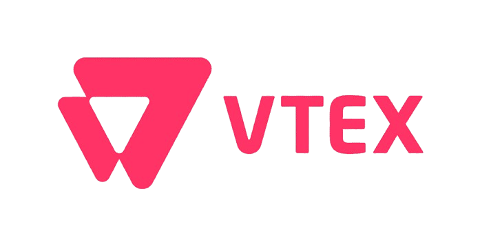
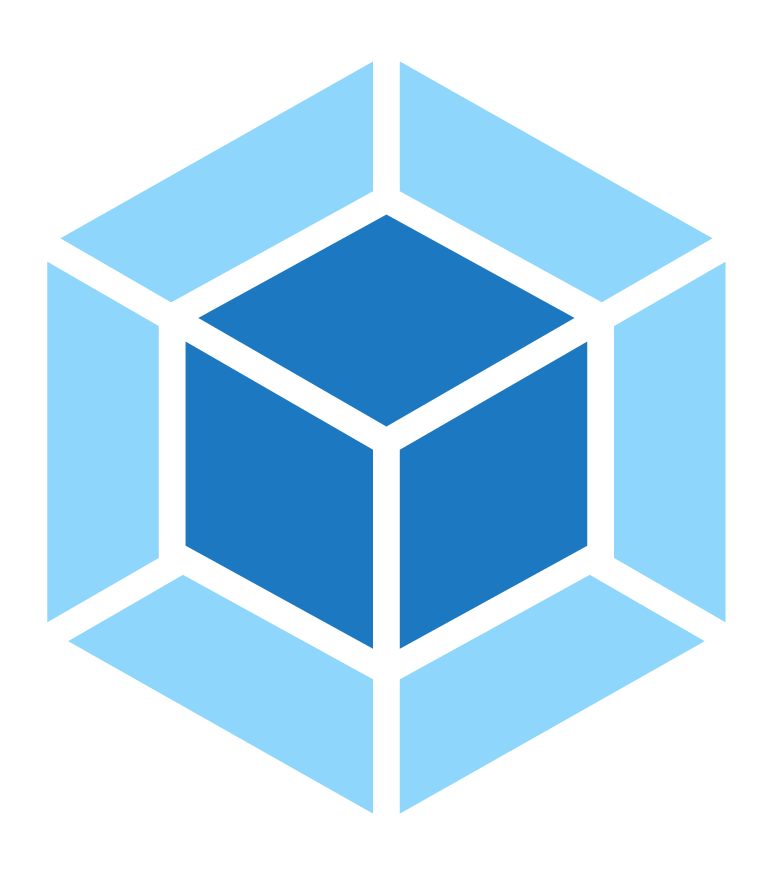
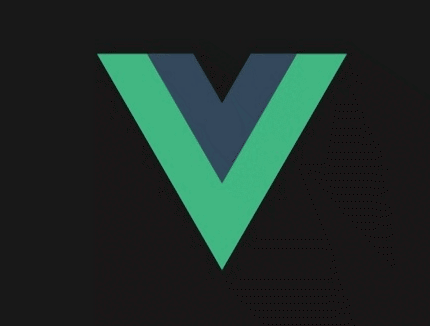

## Hi there 👋

# Hello! Wellcome to my Github 👋 My name is Jose #

 
- 🔭 Full-stack developer with 3+ years of experience designing and building scalable, high-performance web and backend applications 
- 🌱 Proficient in back-end technologies like Node.js, Express, TypeScript with NestJs as well as front-end technologies like React, VtexIO, NextJs 
- 👍 I worked with some AWS tools like SNS, SES, Lamda functions 
- 😍 I developed several integration apps between e-commerce platforms and ERP systems.

 

# Main Skills #

 

# 💻 Tools and technologies I've used

<table align="center">
  <tr>
    <td align="center" width="96">
        
       React
    </td>
    <td align="center" width="96">
        
       JavaScript
    </td>
    <td align="center" width="96">
        
       Webpack
    </td>
     <td align="center" width="96">
        
       Nodejs
      </td>
    <td align="center" width="96">
        
       TypeScript
    </td>
    <td align="center" width="96">
        
       AWS
    </td>
    <td align="center" width="96">
        
       Vite
    </td>
  </tr>
  <tr>
    <td align="center" width="96">
        
       Github
    </td>
    <td align="center" width="96"> 
        
       Git
    </td>
    <td align="center"  width="96">
        
       HTML5
    </td>
    <td align="center" width="96">
        
       CSS
    </td>
    <td align="center" width="96">
        
       Sass
    </td>
    <td align="center"  width="96">
        
       Bootstrap
    </td>
    <td align="center" width="96">
        
       Tailwind
    </td>
  </tr>
 <tr>
      <td align="center" width="96">
        
       MongoDB
    </td>
      <td align="center" width="96">
        
       MySQL
    </td> 
    <td align="center" width="96">
        
       PostgreSQL
    </td>
      </td>
    <td align="center" width="96">
        
       Sequelize
    </td>
    <td align="center" width="96">
        
       VsCode
    </td>
              <td align="center" width="96">
        
       WordPress
    </td>
    <td align="center" width="96">
        
       Vue
    </td>
 </tr>
</table>
  

<!-- # Private Projects I've Worked On

## Trademarktoday Business Website

## InvestFarmLand Business Website

## Google Map API Delivery Site

## Social Media Posting Website (Like Twitter)

## Freelancer Account Creating Bot

## Theme & Dashboard (Kanban)
 -->

